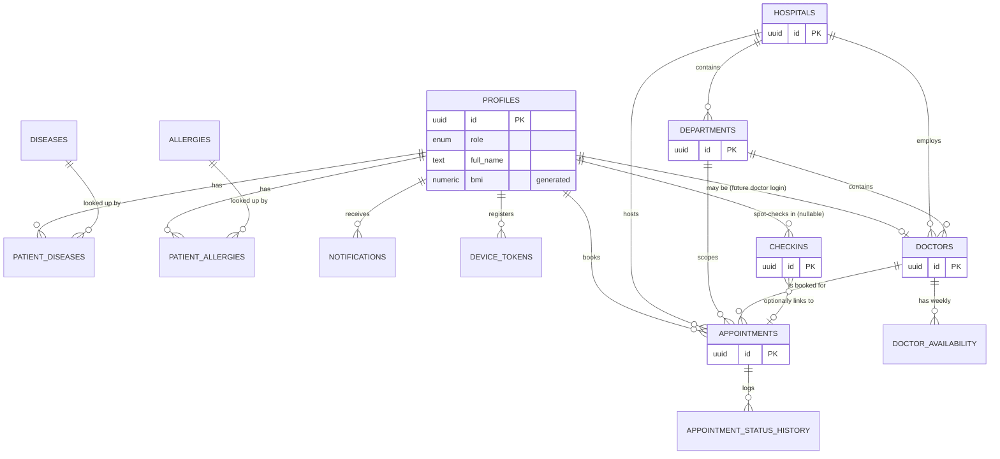

# Database

Live project: `sporting-ethos` (`ieurjkuvrdmmnwursvdk`, Supabase, `ap-south-1`). Schema
defined by the ordered SQL files in [`/supabase/migrations`](../../supabase/migrations)
(repo root — shared by both the web app and this mobile app since they're one backend).

This deployment is scoped to **one hospital** (`hospitals` has exactly one row —
migration 15 removed a second demo hospital seeded in migration 10). The table stays
in the schema rather than being collapsed away because `departments`/`doctors`/
`appointments`/`checkins` still correctly reference it by FK; the app itself has no
hospital picker anywhere (see [architecture.md](architecture.md)).

## ER diagram

## Table notes

| Table | Purpose | Notes |
| --- | --- | --- |
| `profiles` | Extends `auth.users` | `role` enum (patient/doctor/admin); `bmi` is a `GENERATED ALWAYS` column, never written directly |
| `hospitals` / `departments` | Catalog | `departments.department_type` is OPD/IPD/SUPPORT; seeded from the full spec list |
| `doctors` / `doctor_availability` | Directory + weekly schedule | `doctors.profile_id` is a nullable FK reserved for future doctor login |
| `appointments` | Core booking record | Never denormalizes doctor/department/hospital names — always FKs |
| `appointment_status_history` | Audit trail | Auto-populated by a trigger on every insert/status change |
| `diseases` / `allergies` + `patient_*` join tables | Normalized medical history | Patients pick from a catalog rather than free-typing conditions |
| `notifications` | In-app alerts | Auto-populated by a trigger when `appointments.status` changes |
| `device_tokens` | Expo push tokens | One row per device, `expo_push_token` unique |
| `activity_logs` | Generic audit log | Populated by a trigger on `appointments` writes |
| `checkins` | **Pre-existing** kiosk table | See "Coexisting with the kiosk" below — altered, not replaced |

Every new table: UUID PK (`gen_random_uuid()`), `created_at`/`updated_at` with a shared
`set_updated_at()` trigger, FKs with explicit `ON DELETE` behavior, and indexes on every
FK/lookup column actually queried by the app.

## RLS model

A `SECURITY DEFINER` helper, `is_admin()`, reads `profiles.role` so policies can check it
without recursive-RLS problems. Pattern used everywhere:

- **Catalog tables** (`hospitals`, `departments`, `doctors`, `doctor_availability`,
  `diseases`, `allergies`): any authenticated user can `SELECT`; only admin can write.
- **Patient-owned tables** (`profiles`, `appointments`, `patient_diseases`,
  `patient_allergies`, `notifications`, `device_tokens`): a patient can only
  read/write rows where the patient FK equals `auth.uid()`; admin sees everything.
- **`activity_logs`**: admin-only `SELECT`, no client writes (trigger-populated only).

## Coexisting with the existing kiosk (`checkins`)

The web app's reception dashboard and patient kiosk are **both anonymous today** (no
login for staff or patients — see the original `supabase-schema.sql`). Two options were
considered for the mobile app's authenticated model:

1. Tighten `checkins` RLS to match the new ownership model — but this would also stop
   the reception dashboard's live-queue view from working, since staff have no login
   either.
2. **Leave `checkins` RLS exactly as-is** (chosen). `checkins` gained new nullable
   columns (`patient_id`, `hospital_id`, `department_id`, `doctor_id`,
   `appointment_ref`) via `ALTER TABLE` so the mobile app's QR check-in can link a row to
   an authenticated profile, but no existing policy was touched — the web app is
   completely unaffected.

If a harder cutover (requiring staff login) is wanted later, that's a web-app change,
not a mobile or schema change, and should be scoped separately.
